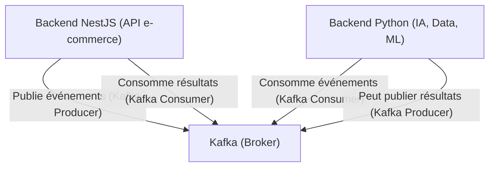

Excellente question ! Voici quelques suggestions pour finaliser et enrichir ton backend, en tenant compte de l’intégration d’une stack IA, mais aussi d’autres axes d’amélioration ou d’industrialisation :

### 1. Intégration d’une stack IA/Data (comme tu l’as évoqué)

- **Kafka** : Mettre en place Kafka pour la gestion des événements (logs, actions utilisateurs, transactions, etc.), ce qui facilitera la collecte de données pour l’IA.
- **Datalake** : Centraliser toutes les données brutes (logs, historiques, clics, etc.) dans un datalake (ex : S3, MinIO).
- **Datawarehouse** : Construire un datawarehouse (ex : BigQuery, Snowflake, Redshift) pour l’analyse et la BI.
- **Pipelines ETL** : Développer des pipelines pour transformer et charger les données du datalake vers le datawarehouse.
- **Système de recommandation** : Développer un microservice ou module pour la recommandation de produits (collaboratif, contenu, hybrid).
- **Agent conversationnel/Assistance AI** : Intégrer un chatbot ou assistant AI pour l’aide à l’achat, le support client, etc.
- **Moteur de suggestions marketing** : Générer des campagnes personnalisées, notifications, emails, etc., basées sur l’analyse des données utilisateurs.
- **Monitoring & Feedback Loop** : Mettre en place des outils pour monitorer les performances des modèles et récupérer du feedback utilisateur.

### 2. Sécurité & conformité

- **Audit de sécurité** : Vérifier la gestion des accès, la protection des données sensibles, la conformité RGPD.
- **Chiffrement** : S’assurer que les données sensibles sont chiffrées au repos et en transit.
- **Gestion fine des rôles et permissions** : RBAC/ABAC pour les différents types d’utilisateurs.

### 3. Observabilité & monitoring

- **Logs centralisés** : Intégrer un stack ELK (Elasticsearch, Logstash, Kibana) ou Loki/Grafana.
- **Alerting** : Mettre en place des alertes sur les erreurs critiques, les anomalies de trafic, etc.
- **Tracing** : Ajouter du tracing distribué (ex : OpenTelemetry, Jaeger).

### 4. Scalabilité & performance

- **Tests de charge** : Effectuer des stress tests pour identifier les goulets d’étranglement.
- **Mise en cache** : Utiliser Redis/Memcached pour accélérer les accès fréquents.
- **Optimisation des requêtes** : Profiler les requêtes SQL/Prisma et optimiser les indexes.

### 5. DevOps & industrialisation

- **CI/CD** : Automatiser les déploiements, les tests, les migrations de base de données.
- **Conteneurisation** : Dockeriser les services, préparer des déploiements Kubernetes.
- **Infrastructure as Code** : Gérer l’infra avec Terraform, Ansible, etc.

### 6. Documentation & expérience développeur

- **Swagger/OpenAPI** : Finaliser la documentation interactive de l’API.
- **README & guides** : Rédiger des guides d’intégration, d’utilisation, de contribution.

### 7. Fonctionnalités métier avancées

- **Gestion fine des promotions, coupons, bundles**.
- **Système de fidélité, parrainage**.
- **Gestion avancée des retours et remboursements**.
- **Marketplace multi-vendeurs (si ce n’est pas déjà fait)**.

---

**En résumé** :  
L’intégration d’une stack IA est un excellent axe, mais tu peux aussi renforcer la sécurité, la scalabilité, l’observabilité, l’industrialisation, et enrichir les fonctionnalités métier.  
Si tu veux des exemples concrets ou des priorités selon ton contexte, n’hésite pas à préciser tes objectifs !

Oui, exactement !  
Pour intégrer une stack IA/Data, il est courant de connecter ton backend principal (ici en NestJS/TypeScript) avec un backend Python (souvent utilisé pour la data science, le machine learning, etc.) via un système de messagerie comme Kafka.

### Pourquoi utiliser Kafka ?

- Kafka permet de faire transiter des messages (événements, données, logs, etc.) entre différents services, écrits dans n’importe quel langage (Node.js, Python, Java, etc.).
- Il agit comme un “bus d’événements” : ton backend NestJS peut publier des événements (ex : nouvelle commande, clic utilisateur, etc.) sur un topic Kafka, et ton backend Python peut consommer ces événements pour les traiter (analyse, scoring, recommandation, etc.).

### Architecture typique

- **Backend NestJS** : Publie des événements (ex : achat, navigation, etc.) sur Kafka.
- **Kafka** : Transporte les messages.
- **Backend Python** : Consomme ces événements, effectue des traitements IA, puis peut publier des résultats (recommandations, scores, etc.) sur d’autres topics Kafka.
- **Backend NestJS** : Peut consommer ces résultats pour enrichir l’expérience utilisateur (ex : suggestions personnalisées).

### Avantages

- **Découplage** : Les deux backends sont indépendants, peuvent évoluer séparément.
- **Scalabilité** : Kafka gère de gros volumes de données en temps réel.
- **Interopérabilité** : Kafka a des clients pour tous les langages majeurs.

### À prévoir

- Définir les schémas de messages (JSON, Avro, Protobuf…).
- Sécuriser Kafka (authentification, chiffrement).
- Superviser les flux (monitoring, gestion des erreurs).

---

**En résumé** :  
Oui, tu connectes ton backend NestJS et ton backend Python via Kafka pour échanger des données et des événements en temps réel, ce qui est idéal pour une stack IA moderne.  
Si tu veux un exemple de code ou d’architecture plus détaillé, dis-le-moi !

Bien sûr ! Voici les 6 premières tâches pour l’intégration d’une stack IA/Data, classées par ordre logique, avec une explication pour chaque ordre :

---

### 1. **Kafka : Mettre en place la gestion des événements**

**Pourquoi en premier ?**  
Kafka est la colonne vertébrale de la communication entre tes services (backend principal, backend IA, etc.). Sans ce bus d’événements, il n’est pas possible de faire transiter les données entre les différents modules ou microservices.  
**But** : Permettre à tous les systèmes de publier et consommer des événements de façon fiable et scalable.

---

### 2. **Datalake : Centraliser les données brutes**

**Pourquoi ensuite ?**  
Une fois Kafka en place, tu peux commencer à collecter et stocker toutes les données brutes (logs, événements, historiques) dans un datalake. Le datalake sert de “réservoir” pour toutes les données, même non structurées, qui pourront être exploitées plus tard.  
**But** : Ne rien perdre, tout stocker pour analyse future, même si tu ne sais pas encore comment tu vas exploiter ces données.

---

### 3. **Pipelines ETL : Transformer et charger les données**

**Pourquoi maintenant ?**  
Les données brutes du datalake doivent être nettoyées, transformées et structurées avant d’être utilisées pour l’analyse ou l’IA. Les pipelines ETL (Extract, Transform, Load) automatisent ce processus.  
**But** : Préparer des données propres, cohérentes et exploitables pour la suite.

---

### 4. **Datawarehouse : Construire l’entrepôt de données**

**Pourquoi après l’ETL ?**  
Le datawarehouse est alimenté par les pipelines ETL. Il sert à stocker les données structurées, prêtes pour l’analyse, la BI, ou l’entraînement de modèles IA.  
**But** : Offrir un accès rapide et optimisé aux données pour les requêtes analytiques et les modèles.

---

### 5. **Système de recommandation : Développer le moteur IA**

**Pourquoi ici ?**  
Maintenant que tu as des données propres et structurées dans le datawarehouse, tu peux développer et entraîner des modèles de recommandation (ou autres IA).  
**But** : Exploiter la donnée pour générer de la valeur métier (recommandations, scoring, etc.).

---

### 6. **Agent conversationnel/Assistance AI**

**Pourquoi en dernier ?**  
L’agent AI (chatbot, assistant, etc.) a besoin de données et/ou de modèles pour fonctionner efficacement. Il peut utiliser les recommandations, les analyses, etc., produits par les étapes précédentes.  
**But** : Offrir une expérience utilisateur enrichie grâce à l’IA, en s’appuyant sur tout ce qui a été mis en place avant.

---

## Récapitulatif ordonné

1. **Kafka** (fondation de la communication)
2. **Datalake** (collecte massive de données)
3. **Pipelines ETL** (préparation/structuration des données)
4. **Datawarehouse** (stockage structuré pour l’analyse)
5. **Système de recommandation** (exploitation IA des données)
6. **Agent conversationnel/Assistance AI** (interface intelligente pour l’utilisateur)

---

**Logique** :  
Chaque étape prépare le terrain pour la suivante. Kafka permet la collecte, le datalake centralise, l’ETL prépare, le datawarehouse structure, le système de recommandation exploite, et l’agent AI valorise tout ce travail auprès de l’utilisateur.

Si tu veux un plan d’action détaillé pour chaque étape, je peux te le fournir !
