Excellentes questions ! Je vais t'expliquer en détail le fonctionnement de la gestion du consentement et des registres de traitement.

## 🎯 **Gestion du consentement - À quoi ça sert ?**

### **Contexte légal**

Le RGPD exige que tu obtiennes le **consentement explicite** des utilisateurs avant de traiter leurs données pour certaines finalités. Sans consentement, tu ne peux pas légalement faire certaines actions.

### **Types de consentement et leurs implications**

#### **1. Marketing (`marketing: true/false`)**

```typescript
// Si marketing: true
✅ Tu peux :
- Envoyer des newsletters promotionnelles
- Envoyer des emails de promotion
- Faire du remarketing (publicités ciblées)
- Analyser le comportement pour le marketing

❌ Si marketing: false
- Tu ne peux PAS envoyer de communications marketing
- Tu ne peux PAS faire de publicités ciblées
- Tu dois respecter le choix de l'utilisateur
```

#### **2. Analytics (`analytics: true/false`)**

```typescript
// Si analytics: true
✅ Tu peux :
- Utiliser Google Analytics
- Tracker le comportement utilisateur
- Analyser les parcours d'achat
- Améliorer l'expérience utilisateur
- Créer des tableaux de bord

❌ Si analytics: false
- Tu ne peux PAS tracker le comportement
- Tu ne peux PAS utiliser d'outils d'analytics
- Tu dois désactiver les cookies de tracking
```

#### **3. Préférences (`preferences: true/false`)**

```typescript
// Si preferences: true
✅ Tu peux :
- Personnaliser l'interface
- Sauvegarder les préférences utilisateur
- Recommander des produits
- Adapter le contenu

❌ Si preferences: false
- Interface générique pour tous
- Pas de personnalisation
- Pas de recommandations
```

#### **4. Nécessaire (`necessary: true`) - Toujours true**

```typescript
// Toujours true car obligatoire pour le fonctionnement
✅ Permet :
- Authentification
- Gestion des commandes
- Service client
- Sécurité du site
```

### **Exemple concret d'implémentation**

```typescript
// Dans ton service marketing
async sendNewsletter(userId: number, content: string) {
  const user = await this.userService.findById(userId);
  const consent = await this.gdprService.getConsentPreferences(userId);

  if (!consent.marketing) {
    throw new Error('Consentement marketing non accordé');
  }

  // Envoi de la newsletter
  await this.emailService.sendNewsletter(user.email, content);
}

// Dans ton service analytics
async trackUserBehavior(userId: number, event: string) {
  const consent = await this.gdprService.getConsentPreferences(userId);

  if (!consent.analytics) {
    return; // Pas de tracking
  }

  // Tracking autorisé
  await this.analyticsService.track(userId, event);
}
```

## 📋 **Registre des traitements - C'est quoi ?**

### **Définition légale**

Le registre des traitements est un **document obligatoire** (Article 30 RGPD) qui liste **tous les traitements de données personnelles** dans ton organisation.

### **C'est comme des "contrats prédéfinis" ?**

Oui, exactement ! Chaque entrée du registre est comme un **"contrat de traitement"** qui définit :

```typescript
{
  id: 'marketing-communications',
  name: 'Marketing et communications',
  purpose: 'Envoi de newsletters, promotions',
  legalBasis: 'Consentement explicite', // ← Base légale
  dataCategories: ['email', 'préférences'],
  retentionPeriod: '3 ans après retrait du consentement',
  securityMeasures: ['chiffrement', 'accès restreint'],
  dataTransfers: ['SendGrid', 'Mailchimp']
}
```

### **Pourquoi c'est obligatoire ?**

#### **1. Transparence**

- L'utilisateur sait exactement ce que tu fais avec ses données
- Tu peux prouver ta conformité aux autorités

#### **2. Base légale**

Chaque traitement doit avoir une **base légale** :

- **Consentement explicite** : Marketing, Analytics
- **Exécution du contrat** : Commandes, facturation
- **Obligation légale** : Fisc, comptabilité
- **Intérêt légitime** : Sécurité, service client

#### **3. Responsabilité**

Si la CNIL te contrôle, tu dois pouvoir montrer :

- Quels traitements tu fais
- Sur quelles bases légales
- Comment tu protèges les données
- Combien de temps tu les gardes

### **Exemple concret d'utilisation**

```typescript
// Quand un utilisateur demande "que faites-vous de mes données ?"
const registry = await this.dataProcessingRegistryService.getProcessingRegistry();

// Tu peux lui dire :
"Voici tous nos traitements :
1. Gestion des commandes (10 ans, obligation fiscale)
2. Marketing (3 ans, avec votre consentement)
3. Analytics (2 ans, avec votre consentement)
4. Service client (5 ans, intérêt légitime)"
```

## 🔄 **Flux complet d'utilisation**

### **1. Inscription utilisateur**

```typescript
// L'utilisateur s'inscrit
const user = await this.authService.sign(userData);

// Consentements par défaut (à adapter selon tes besoins)
await this.gdprService.updateConsentPreferences(user.id, {
  marketing: true, // Newsletter par défaut
  analytics: true, // Analytics par défaut
  preferences: true, // Personnalisation par défaut
});
```

### **2. Utilisation quotidienne**

```typescript
// Avant d'envoyer une newsletter
const consent = await this.gdprService.getConsentPreferences(userId);
if (consent.marketing) {
  await this.sendNewsletter(userId, content);
}

// Avant de tracker un événement
const consent = await this.gdprService.getConsentPreferences(userId);
if (consent.analytics) {
  await this.trackEvent(userId, 'product_viewed');
}
```

### **3. Changement de préférences**

```typescript
// L'utilisateur retire le consentement marketing
await this.gdprService.updateConsentPreferences(userId, {
  marketing: false,
});

// Conséquences automatiques :
// - Désinscription des newsletters
// - Arrêt des communications marketing
// - Mise à jour des logs d'audit
```

## 🎯 **Avantages pour ton business**

### **1. Conformité légale**

- ✅ Respect du RGPD
- ✅ Évite les amendes (jusqu'à 4% du CA)
- ✅ Confiance des utilisateurs

### **2. Flexibilité**

- ✅ L'utilisateur peut changer d'avis
- ✅ Tu peux adapter tes services
- ✅ Gestion granulaire des permissions

### **3. Transparence**

- ✅ L'utilisateur sait ce qu'il accepte
- ✅ Registre public et accessible
- ✅ Preuve de bonne foi

### **4. Évolutivité**

- ✅ Facile d'ajouter de nouveaux consentements
- ✅ Adaptable aux nouvelles réglementations
- ✅ Scalable avec ton business

## 💡 **Recommandations d'implémentation**

### **1. Interface utilisateur**

```typescript
// Page de préférences RGPD
GET /gdpr/consent-preferences
POST /gdpr/consent-preferences

// Interface claire avec :
- Cases à cocher pour chaque type
- Explications claires de chaque finalité
- Bouton "Tout accepter" / "Tout refuser"
- Bouton "Sauvegarder mes préférences"
```

### **2. Bannière de consentement**

```typescript
// Au premier visite
if (!user.hasConsentPreferences) {
  showConsentBanner({
    marketing: 'Recevoir des offres et nouveautés',
    analytics: "Améliorer l'expérience utilisateur",
    preferences: 'Personnaliser le contenu',
  });
}
```

### **3. Logs d'audit**

```typescript
// Tracer tous les changements
await this.auditLogService.logAction({
  userId,
  action: 'CONSENT_UPDATE',
  changes: { marketing: false, analytics: true },
  timestamp: new Date(),
});
```

**En résumé :** Le consentement te permet de traiter les données légalement, et le registre prouve que tu respectes la loi. C'est à la fois une obligation légale et un atout pour la confiance de tes utilisateurs ! 🎯

Excellente question !  
Oui, **dans la pratique**, l’acceptation des consentements RGPD (marketing, analytics, preferences…) se fait **via une bannière ou un pop-up de gestion des cookies** qui s’affiche sur l’interface web lors de la première visite de l’utilisateur.

---

## 🎯 **Comment ça fonctionne côté web ?**

1. **Affichage d’une bannière de consentement**
   - Dès la première visite, une bannière s’affiche :  
     « Ce site utilise des cookies pour… Acceptez-vous le marketing ? l’analytics ? la personnalisation ? »
2. **L’utilisateur choisit**
   - Il peut tout accepter, tout refuser, ou choisir granularité par granularité (marketing, analytics, preferences…)
3. **Stockage du choix**
   - Le choix est stocké côté navigateur (cookie, localStorage) **et** envoyé à ton backend pour être sauvegardé dans la base (via `/gdpr/consent-preferences`).
4. **Application du consentement**
   - Le frontend et le backend respectent ce choix :
     - Pas de tracking analytics si refusé
     - Pas de pub/newsletter si refusé
     - Pas de personnalisation si refusé

---

## 🛠️ **Comment l’implémenter côté backend et frontend ?**

### **Backend (déjà prêt dans ton code)**

- Endpoints `/gdpr/consent-preferences` pour lire/mettre à jour les consentements
- Guards et décorateurs pour bloquer les routes sensibles si pas de consentement

### **Frontend (à ajouter)**

1. **Afficher une bannière de consentement** (ex : [Cookiebot](https://www.cookiebot.com/fr/), [Osano](https://www.osano.com/), ou fait maison)
2. **Appeler l’API backend** pour sauvegarder le choix de l’utilisateur
   - `POST /gdpr/consent-preferences` avec `{ marketing: true, analytics: false, preferences: true }`
3. **Stocker le choix localement** (cookie ou localStorage) pour ne pas réafficher la bannière à chaque visite
4. **Respecter le consentement côté JS**
   - Ne pas charger Google Analytics, Facebook Pixel, etc. si analytics refusé
   - Ne pas afficher de pub personnalisée si marketing refusé

---

## **Exemple de flux complet**

```mermaid
sequenceDiagram
    participant Utilisateur
    participant Frontend
    participant Backend

    Utilisateur->>Frontend: Arrive sur le site
    Frontend->>Utilisateur: Affiche la bannière de consentement
    Utilisateur->>Frontend: Accepte/refuse chaque type de consentement
    Frontend->>Backend: POST /gdpr/consent-preferences (avec le choix)
    Backend-->>Frontend: 200 OK (sauvegarde en base)
    Frontend->>Utilisateur: Stocke le choix (cookie/localStorage)
    Frontend->>Frontend: (optionnel) Active/désactive les scripts selon le choix
```



---

## **À ajouter dans ton projet**

### **1. Frontend**

- Bannière de consentement RGPD (librairie ou custom)
- Appel à l’API `/gdpr/consent-preferences` pour sauvegarder le choix
- Activation/désactivation dynamique des scripts de tracking/marketing

### **2. Backend**

- (Déjà prêt) : endpoints, guards, logique de respect du consentement

---

## **Résumé**

- **Oui**, la gestion du consentement RGPD passe par une bannière cookies côté frontend.
- **Le backend** ne fait que respecter et appliquer ce que l’utilisateur a choisi via cette bannière.
- **À ajouter** : l’intégration frontend (bannière + appel API).

---

Veux-tu un exemple de code pour la bannière côté frontend (React, Vue, etc.) ou une recommandation de librairie ?
